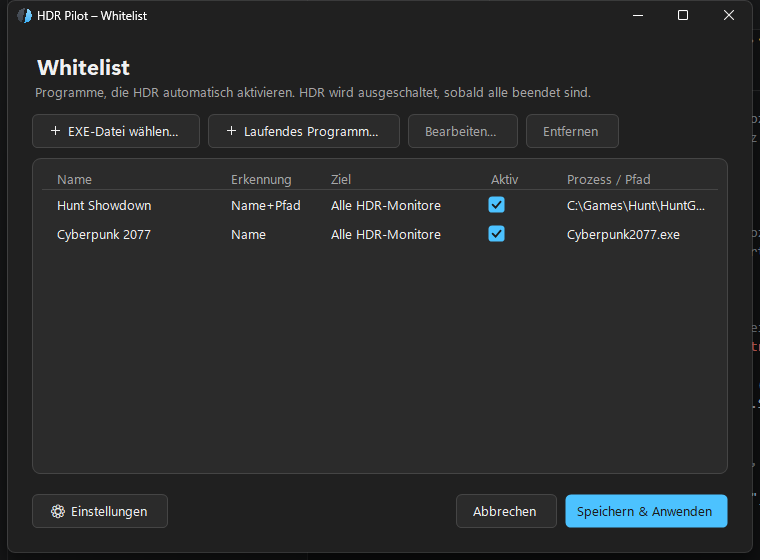

<p align="center">
  
</p>

<h1 align="center">HDR Pilot</h1>

<p align="center">
  Windows tray app that automatically enables HDR when whitelisted games or apps launch —<br>
  and restores the previous HDR state once they exit.
</p>

<p align="center">
  <a href="https://github.com/M0dds/hdrpilot/releases/latest"><b>⬇ Download the latest release</b></a>
</p>

<p align="center">
  
</p>

## Why?

Windows only offers a global HDR toggle (`Win + Alt + B`) — and leaving HDR on all the
time makes SDR content look washed out. HDR Pilot flips the switch for you: add your
games to a whitelist, and HDR turns on the moment they start and off once they close.

## Features

- **Automatic HDR per program** via a whitelist — matched by process name
  (case-insensitive), full path, or both.
- **Windows Auto HDR per game** (opt-in per entry): HDR Pilot sets the per-app
  Auto HDR preference in the Windows graphics settings, and — if Auto HDR is
  turned off globally — enables it just for the game session and restores the
  previous state afterwards. So SDR games get the HDR upgrade without leaving
  Auto HDR on system-wide.
- **State restoration**: HDR is only enabled where it was off, and the previous
  state is restored once all whitelisted programs have exited (configurable).
- **Multi-monitor aware**: target the primary display only (default), all
  HDR-capable displays, or pick specific monitors per whitelist entry.
- **Reference counting + debounce**: several programs hold HDR together; quick
  restarts (launcher → game) don't cause flicker.
- **Event-based process detection** via WMI subscriptions — no polling by the app.
- **Runs as a standard user**: no admin rights, no service, no UAC prompts.
- **Native switching** through the Windows `DisplayConfig` API
  (Windows 11 24H2 `SET_HDR_STATE` with automatic legacy fallback) — no Xbox Game
  Bar, no simulated hotkeys.
- **Fluent-style UI** with light & dark mode (follows Windows by default) in
  English, German, French, and Spanish.
- **Optional autostart** with Windows (HKCU run key).

## Getting started

1. Grab `HdrPilot.exe` from the [latest release](https://github.com/M0dds/hdrpilot/releases/latest) —
   a single self-contained file, no installation and no .NET runtime required.
2. Run it. On first start the whitelist window opens; afterwards the app lives in
   the system tray (left-click the icon to open it again).
3. Add your games via **Choose .exe file…** or **Running program…**, hit
   **Save & apply** — done. Language, theme, and behavior live under **Settings**.

> **SmartScreen note:** the executable is not code-signed, so Windows may show
> "Windows protected your PC" on first launch. Click **More info → Run anyway**.

Configuration is stored as plain JSON in `%AppData%\HdrPilot\config.json`
(with a log file next to it), so it's easy to inspect, back up, or edit by hand.

## Requirements

- Windows 11 (24H2 / build 26100+ recommended; older Windows 11 builds use the
  legacy advanced-color API automatically). Windows 10 is not supported.
- An HDR-capable display and GPU.

## Building from source

Requires the .NET 8 SDK.

```powershell
# Debug build
dotnet build HdrPilot.sln

# Self-contained single-file release
dotnet publish src/HdrPilot/HdrPilot.csproj -c Release -r win-x64 --self-contained true -p:PublishSingleFile=true -p:IncludeNativeLibrariesForSelfExtract=true -o publish
```

The finished `HdrPilot.exe` ends up in `publish/`.

### Architecture

```
src/HdrPilot/
├── Models/          Data types (whitelist, config, monitor, match mode)
├── Native/          P/Invoke signatures for the DisplayConfig API
├── Core/
│   ├── HdrController      Wraps the native API (24H2 + legacy fallback)
│   ├── AutoHdrController  Per-app Auto HDR tokens + session-scoped global toggle
│   ├── RtxHdrDetector     Best-effort RTX HDR detection (NVIDIA driver profiles)
│   ├── ProcessWatcher     WMI start/stop events + enumeration
│   ├── ConfigStore        JSON persistence + autostart registry key
│   └── AutoSwitchEngine   Core logic: ref-counting, debounce, switching
├── UI/              Tray context, whitelist window, dialogs, custom controls
└── Program.cs       Entry point (single instance, data migration)
```

The UI is built from fully custom-drawn Windows-11-style controls (buttons,
dropdowns, text boxes, lists) because native WinForms theming is unreliable in
dark mode.

## Good to know

- **Auto Color Management (ACM):** if Windows' "Automatically manage color for
  apps" is enabled, HDR detection can behave differently. HDR Pilot detects ACM
  via the 24H2 API, logs a warning, and keeps working.
- **NVIDIA RTX HDR:** when you enable Auto HDR for a game, HDR Pilot warns if
  RTX HDR appears to be active for it — both tone-map the image and conflict, so
  use only one. Note that current NVIDIA drivers manage RTX HDR exclusively
  inside the NVIDIA app (the state no longer lives in the driver profiles), so
  HDR Pilot cannot toggle RTX HDR for you and the conflict detection is
  best-effort.
- **What it does *not* do:** HDR Pilot doesn't touch tone mapping parameters,
  SDR brightness, or color calibration. It toggles HDR (and, opt-in, Windows
  Auto HDR) exactly like the Windows settings do — just automatically and per
  program/monitor. For calibration, use the Windows HDR Calibration app.
- Without admin rights, `Win32_ProcessStartTrace` is unavailable; the app then
  falls back to WMI instance events (`WITHIN 2`) automatically.

## License

Free for personal use and modification.
